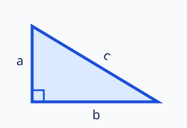

#+title: Xenops math and image fixture

* Pythagorean theorem
:PROPERTIES:
:ID: technical-pythagoras
:ANKIDEMY_TYPE: definition
:ANKIDEMY_CODE: geometry.pythagoras
:END:

** What relationship holds in a right triangle? :version:
:PROPERTIES:
:ID: technical-pythagoras-v1
:ROAM_EXCLUDE: t
:END:
Xenops may overlay this standard Org inline fragment: \(a^2+b^2=c^2\).

The display form must become Markdown display math:
\[c=\sqrt{a^2+b^2}.\]

The environment form must retain its TeX line break:
\begin{align}
a^2+b^2 &= c^2 \\
c^2-a^2 &= b^2
\end{align}

*** Notes :notes:
The diagram belongs to this definition version, not to the containing file.

#+attr_html: :alt "Right triangle" :width 320

* Apply the Pythagorean theorem
:PROPERTIES:
:ID: technical-pythagoras-exercise
:ANKIDEMY_TYPE: exercise
:ANKIDEMY_CODE: geometry.pythagoras.compute
:END:

** A right triangle has legs 3 and 4. Find the hypotenuse. :version:
:PROPERTIES:
:ID: technical-pythagoras-exercise-v1
:ROAM_EXCLUDE: t
:ANKIDEMY_DIFFICULTY: 2
:ANKIDEMY_VERIFIABLE: t
:END:
Use [[id:technical-pythagoras][the Pythagorean theorem]].

*** Hints :hints:
Compute $\sqrt{3^2+4^2}$.

*** Solution :solution:
5
